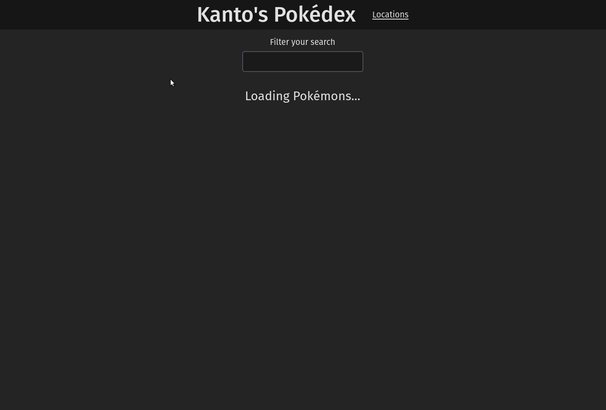
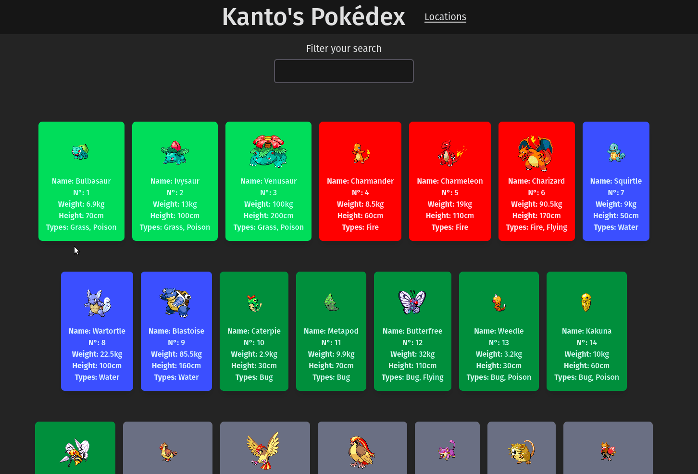
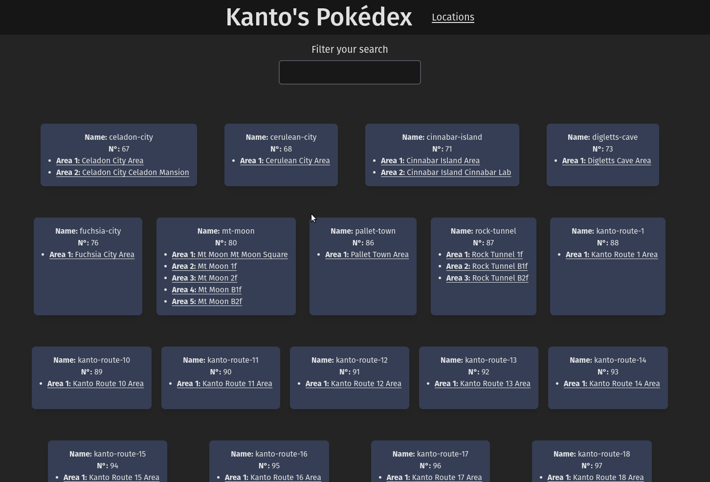

<h1>
  
  React Pokédex
  
</h1>

Pokédex application made with React to consume and display Pokémons and Locations with their areas of Kanto's region from PokéAPI.

### 🎯 Main Features
Search through all classic Kanto's pokémons.


Inspect specific pokémons with their base stats.


Search through all Kanto's locations with their respective areas.


Inspect specific areas with their Pokémons encounters.


## ⚙️ Installation
For being a React application, it is necessary to clone this repository first in your local device:
```sh
$ git clone https://github.com/yandevv/simpleReactPokedex
```

Now, with project downloaded, it is possible to download and install the Node dependencies:
```sh
$ npm install
```

## 🛠️ Usage
> Node version >= 20.1 and npm version >= 8.19.4 required

It is possible to run the project in development (with HMR and Typescript) or in production.

To run the project in development, you just need [install](#installation) the project successfully and run:
```sh
$ npm run dev
```

Or if you need to run in production, build the project running:
```sh
$ npm run build
```

And run:
```sh
$ npm run preview
```